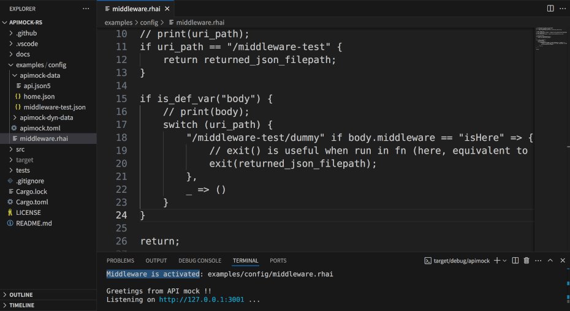

# apimock-rs

[](https://crates.io/crates/apimock)
[](https://docs.rs/apimock)
[](https://deps.rs/crate/apimock)
[](https://github.com/nabbisen/apimock-rs/actions/workflows/release-executable.yaml)
[](https://github.com/nabbisen/apimock-rs/blob/main/LICENSE)

## 🛠️ App overhaul announcement

### ⚠️ Major update in development (v4)

v4 introduces a fundamental shift in design. Existing configuration files will no longer work as-is. Some features will be deprecated.
In return: cleaner configs, dynamic resolution, and better extensibility.

## Summary

HTTP server generating REST/JSON responses. Aims to be mocking helper to develop microservices and APIs. Written in [Rust](https://www.rust-lang.org/) and based on [hyper](https://hyper.rs/).

Running `apimock` or `apimock -c apimock.toml` starts the server. Built as small single native binary. Supports cross-platform.

## Screenshots

Server started to listen:


`curl` test result:


Middleware is available as `rhai` script:



### Reference

- [Features](docs/FEATURES.md)
- [Configuration and options](docs/CONFIGURE.md)
- [Design and specification](docs/SPECS.md)

## Usage

### Executable

[Assets](https://github.com/nabbisen/apimock-rs/releases/latest) in Releases offer executables for multiple platforms.

```sh
./apimock
```

At startup, [`--init`](docs/CONFIGURE.md#--init) option is available to gerenate app configuration and customization files:

```sh
./apimock --init
```

#### Customization

- Able to customize by modifying [config file](docs/CONFIGURE.md) (`./apimock.toml` by default) and restarting app.
- [Dynamic routing directory](docs/CONFIGURE.md#generaldyn_data_dir) is also available (`./apimock-dyn-data/` by default) even without config file. App returns response by associating request URL path with relative file path under it.
- When app runs without both `./apimock.toml` and `./apimock-dyn-data/` directory, [`always`](./CONFIGURE.md#configuration) option is automatically activated to return fixed response.

### `cargo` install

```sh
cargo install apimock
# after installed:
apimock
```

## Acknowledgements

Depends on:

[tokio](https://github.com/tokio-rs/tokio) / [hyper](https://hyper.rs/) / [toml](https://github.com/toml-rs/toml) / [serde](https://serde.rs/) / [serde_json](https://github.com/serde-rs/json) / [json5](https://github.com/callum-oakley/json5-rs) / [console](https://github.com/console-rs/console) / [rhai](https://github.com/rhaiscript/rhai). In addition, [mdbook](https://github.com/rust-lang/mdBook) (as to workflows)
