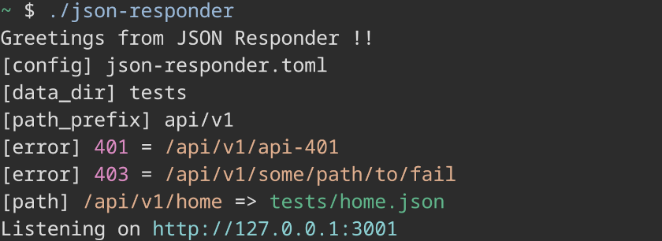
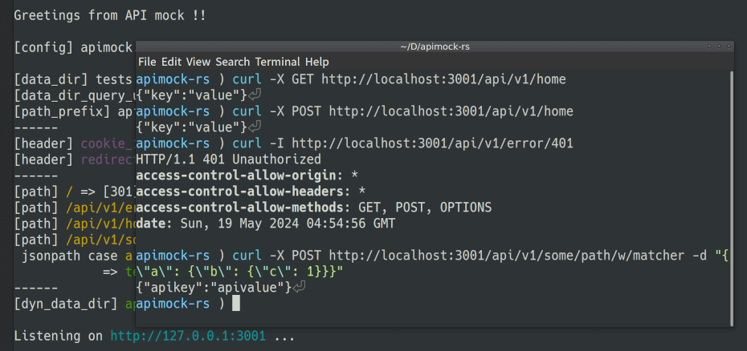
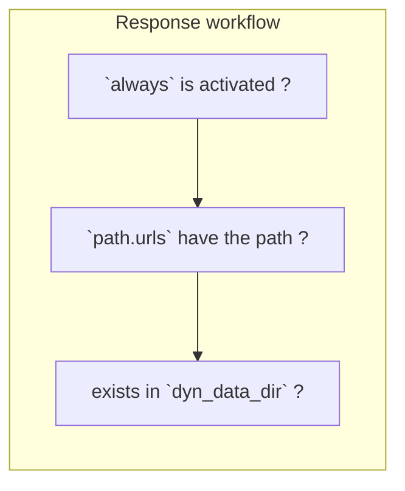

# apimock-rs

Mocking helper to develop microservices and APIs. [hyper](https://hyper.rs/)-based HTTP server generating REST responses containing JSON ones. Written in [Rust](https://www.rust-lang.org/).

[](https://github.com/nabbisen/apimock-rs/blob/main/LICENSE)

## Summary

Aims to help developers to easily get responses from dummy API, especially microservice API,  according to several paths.
Each single executable on Win/Mac/Linux are available, thanks to Rust and their cross-platform support. [Releases](../../releases) are "out-of-the-box" coming with default config `apimock.toml`.

\* Renamed from `json-responder`. Now more than returning JSON data.

### Screenshots

Server started to listen:



`curl` test result:



### Designed in mind with

- Performance
    - Fast speed
    - Low memory consumption
- Easy setup/usage
    - Built as single (and small) executable
    - Integrated configuration
        - No need to write scripts
        - Config-less mode is also supported
- Cross-platform support

### Features

- GET / POST methods
- Multiple paths
- Multiple .json/.json5 files treated as JSON Response
- Dynamic path resolution with `dyn_data_dir`
- Custom responses codes (HTTP 3xx as redirects and 4xx and 5xx as errors)
- Custom headers and their reusabliblity
- Validates configuration: Missing JSON files, duplicate paths etc.
- Prints out routing at startup

## Installation

- [Releases](../../releases) are available.
  - Create your configuration file (`./apimock.toml` by default) and run `apimock` with it.
- Via cargo: `cargo install apimock`
- Also able to [build manually](#build-manually).
  - Run `cargo build --release`. Then run to start the server: `./target/release/apimock`.
  - Alternatively, just running `cargo run` works.

Running `apimock` without either `apimock.toml` or `apimock-data/` directory results in `always` option activated.

## Usage

### Configure

`apimock.toml`

```toml
[general]
port = 3001                                   # optional
dyn_data_dir = "apimock-data"                 # optional
# always = "{ greetings: \"Hello, world.\" }" # optional

[url]
path_prefix = "api/v1" # optional
data_dir = "tests"                            # optional

[url.headers]
cookie_1 = { key = "Set-Cookie", value = "a=b; c=d" }
redirect_1 = { key = "Location", value = "/api/v1/home" }

# required when `always` is not specified
[url.paths] # `path_prefix` works
"home" = "home.json"
# "some/path" = "api.json5"
# custom headers
"some/path/w/header" = { src = "home.json", headers = ["cookie_1"] }
# errors / redirects * `code` must be defined as **unsigned integer** (instead of String)
"error/401" = { code = 401 }
"error/api-403" = { code = 403 }
"redirect/302" = { code = 302, headers = ["redirect_1"] }

[url.raw_paths] # `path_prefix` doesn't work
"/" = { text = "{ Hello: world }", code = 301, headers = ["cookie_1", "redirect_1"] }
```

#### Properties

##### `general.dyn_data_dir`

If set, URL path without statically defined path matched is converted to file path in this directory. Server tries to find it out as either `.json` or `.json5`. When found, server returns the content as JSON response.    
**Default**: empty

It works even without config toml. It is config-less mode.

##### `url.path_prefix`

Static paths are dealt with as those who have the prefix. Convenient when your service has path prefix.    
**Default**: empty

##### `url.data_dir`

Data directory used as where to look up files when HTTP response is built.    
**Default**: executable directory

##### `url.headers`

HTTP headers such as `Authorizaton: xxx` on auth and `Location: xxx` on redirection.
You can reuse them and easily attach headers in `url.paths` by defining here.    
**Default**: None

##### `url.paths`

The key, the left-hand side, is URL path. The right-hand one is response definition.
Response definition consists of four optional parts: `code` as HTTP code, `headers` as HTTP headers keys defined in `url.headers`, `src` as data source file relative path in `url.data_dir` and `text` as direct body text instead of `src`. For example:

```toml
"url_path" = { code = 200, headers = ["header_key_1"], src = "response_1.json" }
```

It is able to omit code and headers. For example:

```toml
"url_path" = "response_1.json"
```

It means `src` and it's far simpler. `code` and `headers` are dealt with as their default: 200 as OK and no custom headers.

Only when either `src` or `text` is defined, the response `Content-Type` is set as `application/json`.

##### `url.raw_paths`

Not affected by `url.path_prefix`. Everything else is the same to `url.paths`.

### Options

#### `-c` / `--config`

Config file path.
default: `apimock.toml`

### After server started

What is modifiable:

- content of path data src: `.json` / `.json5`

What is NOT modifiable:

- `always` config
- routing on `paths`
- `code` / `headers` / data text on each path

### How response works



## How to embed to development environment

With Node.js project, `scripts` in `package.json` is available.
For example, run `npm run apimock` with `package.json` written in as below:

```json
{
  "scripts": {
    "apimock": "./apimock"
  }
}
```

## Acknowledgements

Depends on:

[tokio](https://github.com/tokio-rs/tokio) / [hyper](https://hyper.rs/) / [toml](https://github.com/toml-rs/toml) / [serde](https://serde.rs/) / [serde_json](https://github.com/serde-rs/json) / [json5](https://github.com/callum-oakley/json5-rs) / [console](https://github.com/console-rs/console). In addition, [mdbook](https://github.com/rust-lang/mdBook) (as to workflows)
