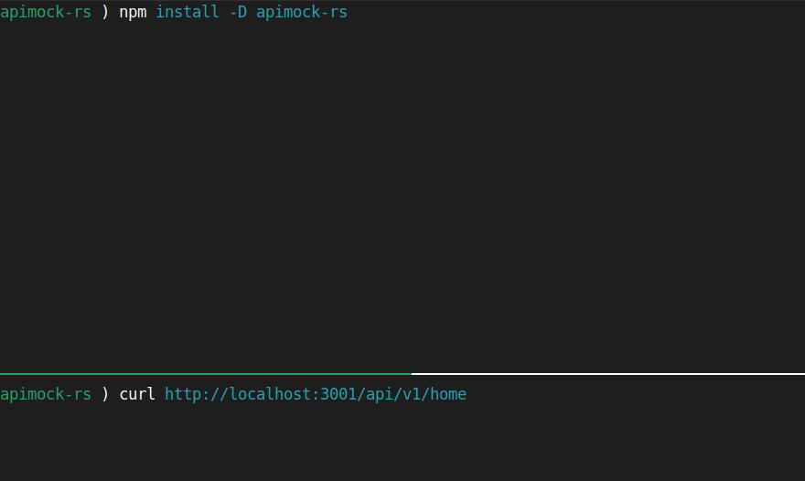

# API mock (apimock-rs)

[](https://crates.io/crates/apimock)
[](https://docs.rs/apimock)
[](https://deps.rs/crate/apimock)
[](https://github.com/nabbisen/apimock-rs/actions/workflows/release-executable.yaml)
[](https://github.com/nabbisen/apimock-rs/blob/main/LICENSE)

---

## 🛠️ App overhaul announcement

### ⚠️ Major update in development (v4)

v4 introduces a fundamental shift in design. Existing configuration files will no longer work as-is. Some features will be deprecated.
In return: cleaner configs, dynamic resolution, and better extensibility.

Notice below is around v4 and current stable version is [v3](https://github.com/nabbisen/apimock-rs/tree/3.2.2).

---

## 🪄 Mock APIs easily — no setup stress, just JSON and go

If you’re building or testing APIs, this tool makes mocking painless. You don’t need to write any config files — just use folders and JSON. It’s super fast, efficient, and flexible when you need it to be.

    🎈 No config needed to get started

    🥷 Fast to launch, light on memory, out of your way

    🧩 Moreover, advanced matching and custom scripting supported

It’s rebuilt from the ground up in version 4. Designed to help developers of all levels.



```sh
# install
npm install -D apimock-rs
# and go
npx apimock
```

```sh
# just use folders and JSON
mkdir -p api/v1/
echo '{"hello": "world"}' > api/v1/hello.json
npx apimock

# response
curl http://localhost:3001/api/v1/hello
# --> {"hello":"world"}
```

```sh
# also, there's room to tweak things later
npx apimock --init
```

### 📖 Documentation

For more details, check out [the docs](docs/README.md).

### 💻️ GUI bundle

[apimokka](https://github.com/nabbisen/apimokka), lightweight GUI bundle, is also available.

---

## Open-source, with care

This project is lovingly built and maintained by volunteers.  
We hope it helps streamline your API development.  
Please understand that the project has its own direction — while we welcome feedback, it might not fit every edge case 🌱

## Acknowledgements

Depends on [tokio](https://github.com/tokio-rs/tokio) / [hyper](https://hyper.rs/) / [toml](https://github.com/toml-rs/toml) / [serde](https://serde.rs/) / [serde_json](https://github.com/serde-rs/json) / [json5](https://github.com/callum-oakley/json5-rs) / [console](https://github.com/console-rs/console) / [rhai](https://github.com/rhaiscript/rhai). In addition, [mdbook](https://github.com/rust-lang/mdBook) (as to workflows).
