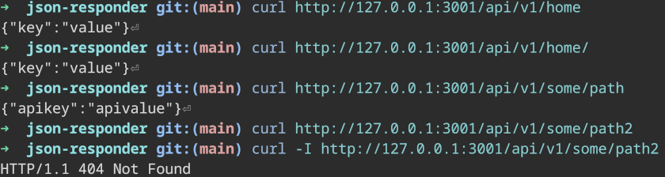

# json-responder

Server generating JSON responses written in [Rust](https://www.rust-lang.org/).
Aims to help dev to easily get dummy API responses due to several paths.

[](https://github.com/nabbisen/json-responder/blob/main/LICENSE)

## Summary

Designed in mind with:

- Fast performance
- Low memory consumption
- Cross-platform support

### Features

- Multiple .json/.json5 files treated as JSON Response
    - [JSON5](https://json5.org/) support
- Multiple paths
- Error responses (HTTP 400 ~ 599)

## Usage

### Build

```
cargo build --release
```

### Run

```
./target/release/json-responder
```

Alternatively, just running `cargo run` works.

#### Notes

What is modifiable after server started:

- content of `.json` / `.json5`

What is not modifiable after server started:

- `always` config
- routing on `paths` / `errors`

#### Screenshots

Server started to listen:


`curl` test result:



### Configure

`json-responder.toml`

```toml
[general]
port = 3001                                   # optional
data_dir = "tests"                            # optional
# always = "{ greetings: \"Hello, world.\" }" # optional

[url]
path_prefix = "api/v1" # optional
# required when `always` is not specified
[url.paths]
home = "home.json"
# "some/path" = "subdir/some_path.json5"
[url.errors]
403 = ["403"]
404 = []
```

### Options

#### `-c` / `--config`

Config file path.
default: `json-responder.toml`

## Acknowledgements

Depends on:

[tokio](https://github.com/tokio-rs/tokio) / [hyper](https://hyper.rs/) / [toml](https://github.com/toml-rs/toml) / [serde](https://serde.rs/) / [serde_json](https://github.com/serde-rs/json) / [json5](https://github.com/callum-oakley/json5-rs) / [console](https://github.com/console-rs/console)
