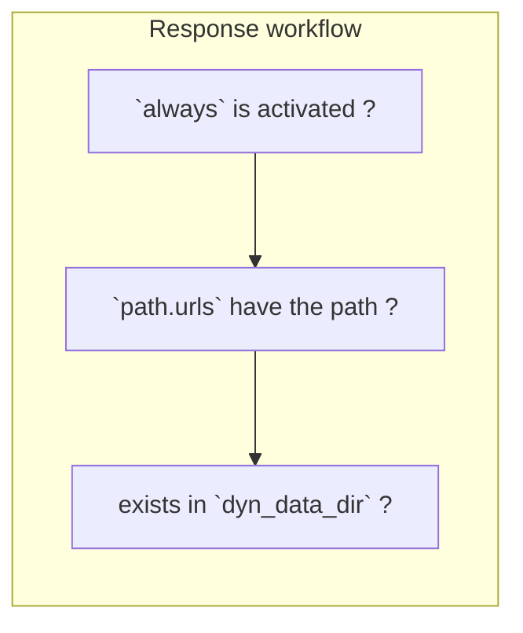

# apimock-rs

Microservice APIs mocking helper. [hyper](https://hyper.rs/)-based HTTP server generating REST responses containing JSON application ones. Written in [Rust](https://www.rust-lang.org/).

[

## Summary

Aims to help dev to easily get dummy API, especially microservice API, responses due to several paths.
Single executables on Win/Mac/Linux are available, thanks to Rust. [Releases](../../releases) are "out-of-the-box" coming with default config `apimock.toml`.

### Screenshots

Server started to listen:


`curl` test result:


### Designed in mind with

- Performance
    - Fast speed
    - Low memory consumption
- Easy usage
    - Built as single (and small) executable
    - Integrated configuration
- Cross-platform support

### Features

- GET / POST methods
- Multiple .json/.json5 files treated as JSON Response
- Multiple paths
- Dynamic path resolution with `dyn_data_dir`
- Error responses (HTTP 4xx and 5xx)
- Validates configuration: Missing JSON files, duplicate paths etc.
- Prints out routing at startup

## Usage

[Releases](../../releases) are available. Also able to [build manually](#build-manually).

After downloading it or building, run `apimock` with your configuration file (`./apimock.toml` by default).

### Configure

`apimock.toml`

```toml
[general]
port = 3001                                   # optional
dyn_data_dir = "apimock-data"                 # optional
# always = "{ greetings: \"Hello, world.\" }" # optional

[url]
path_prefix = "api/v1" # optional
data_dir = "tests"                            # optional

# required when `always` is not specified
[url.paths] # `path_prefix` works
"home" = "home.json"
# "some/path" = "api.json5"
# custom headers
"some/path/w/header" = { src = "home.json", headers = ["auth_1"] }
# errors / redirects * `code` must be defined as **unsigned integer** (instead of String)
"error/401" = { code = 401 }
"error/api-403" = { code = 403 }
"redirect/302" = { code = 302, headers = ["redirect_1"] }

[url.raw_paths] # `path_prefix` doesn't work
"/" = { text = "{ Hello: world }", code = 202, headers = ["auth_1", "redirect_1"] }

[url.headers]
auth_1 = { key = "Authorization", value = "xxx" }
redirect_1 = { key = "Location", value = "xxxxxx" }
```

### How to embed to development environment

With Node.js project, `scripts` in `package.json` is available.
For example, run `npm run apimock` with `package.json` written in as below:

```json
{
  "scripts": {
    "apimock": "./apimock"
  }
}
```

### Options

#### `-c` / `--config`

Config file path.
default: `apimock.toml`

### After server started

What is modifiable:

- content of path data src: `.json` / `.json5`

What is NOT modifiable:

- `always` config
- routing on `paths`
- `code` / `headers` / data text on each path

### How response works



## Build manually

```
cargo build --release
```

Then run to start the server:

```
./target/release/apimock
```

Alternatively, just running `cargo run` works.

## Acknowledgements

Depends on:

[tokio](https://github.com/tokio-rs/tokio) / [hyper](https://hyper.rs/) / [toml](https://github.com/toml-rs/toml) / [serde](https://serde.rs/) / [serde_json](https://github.com/serde-rs/json) / [json5](https://github.com/callum-oakley/json5-rs) / [console](https://github.com/console-rs/console). In addition, [mdbook](https://github.com/rust-lang/mdBook) (as to workflows)
