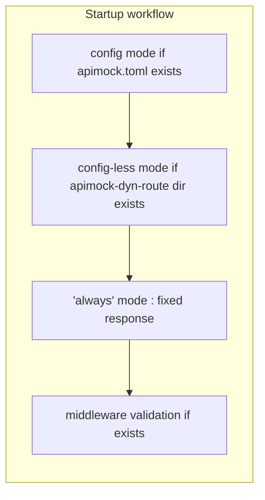
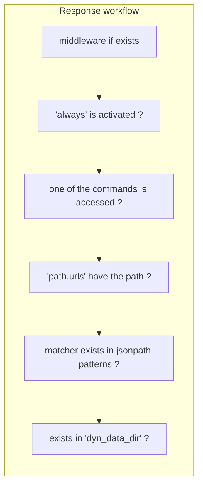

# Specs

## Designed in mind with

- Performance
    - Fast speed, low memory consumption.
- Easy setup/usage
    - Built as single (and small) executable, integrated configuration. (No need to write scripts, config-less mode is also supported.)
- Cross-platform support

## How startup works

### How response works

