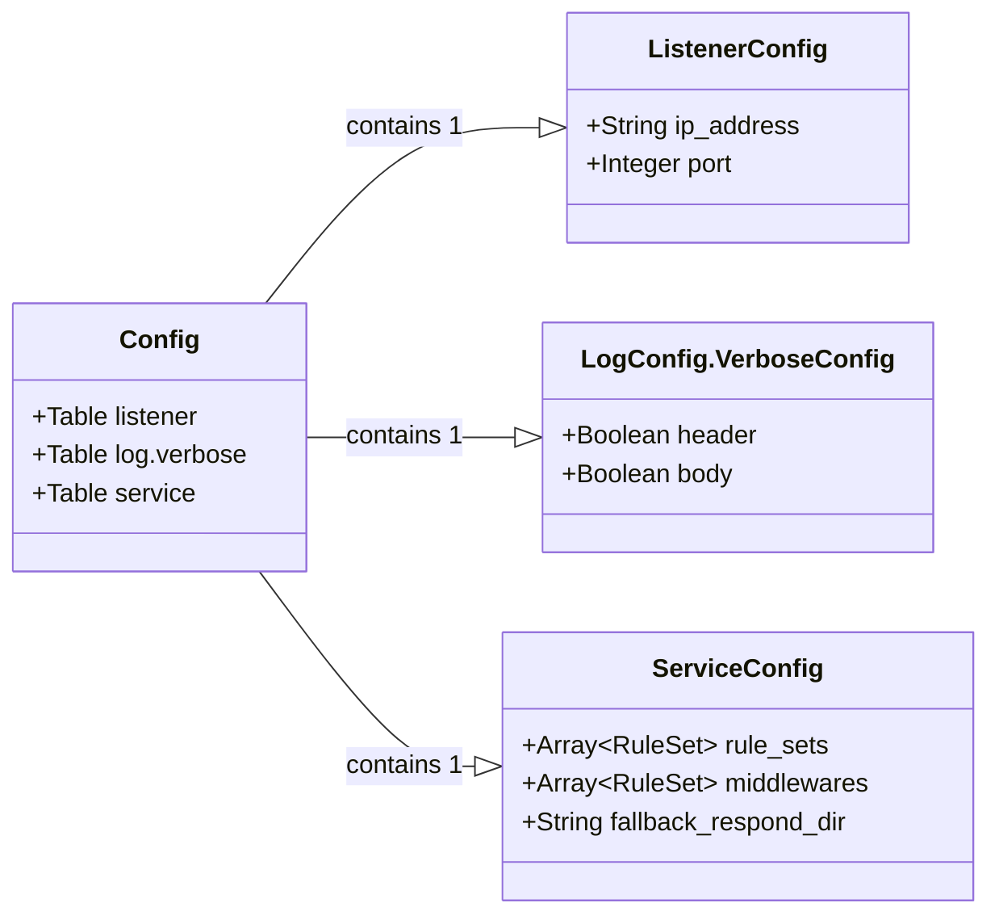

# Configuration overview

Here's an overview of the rule data structure in a nested Markdown format:

- `apimock.toml`
    - `[listener]` (Table): Server listener.
        - `ip_address`
        - `port`
    - `[log]` (Table): Logger.
        - `verbose.header`: Verbose on request header.
        - `verbose.body`: Verbose on request body.
    - `[service]` (Table): App service
        - **`rule_sets`:** Rule-based routing. The detail is [here](rule-set-config-structure/rules/).
        - `middlewares`
        - **`fallback_respond_dir`:** File-based routing base. The default is `.`, your current directory.
