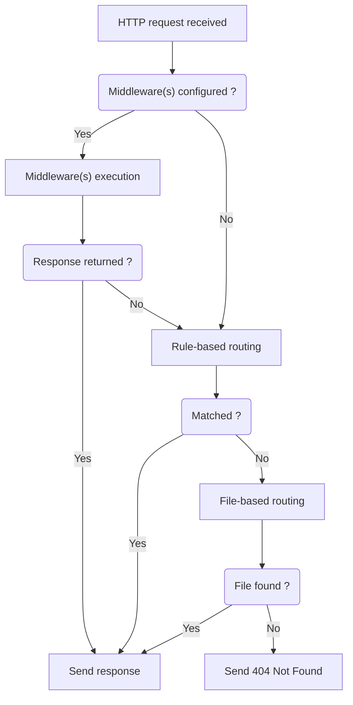

# How the server decides a response

When your mock server receives an HTTP request, it follows a specific flow to determine which response to return. Understanding this hierarchy is key to structuring your rules effectively:

## Response decision flow

### Steps

- **Middleware(s) execution:**    
    If **middlewares** are configured, the server executes them first. If a middleware explicitly returns a response, that response is sent immediately.

- **Rule-based routing:**    
    If no middleware responds, the server checks your **rule sets** from top to bottom. **The first rule that completely matches** the request's conditions will have its response returned.

- **File-based routing:**    
    If no rule matches, the server falls back to **file-based routing**. It tries to find a file matching the request URL path (e.g., by adding `.json`, `.json5` or `.csv` extensions). If found, its content is returned, and `Content-Type` is automatically determined.

- **404 Not Found:**    
    If no response is determined by any of the above methods, the server returns an `HTTP status code 404 Not Found`.

### First-match strategy

Throughout this entire flow, the **first-match strategy** applies. This means the server will always adopt the very first valid response it finds, from middleware to file-based routing, and stop processing further.
