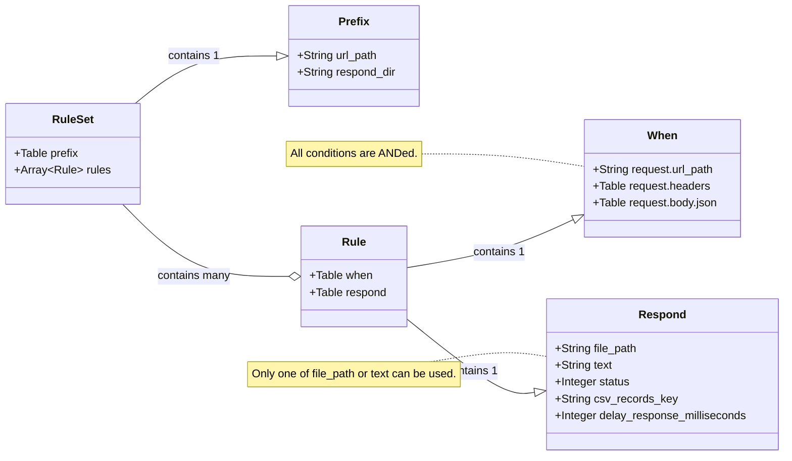

# Rules array of tables

`[[rules]]`, each rule record, consists of a `when` table and a `respond` table.

Here's an overview of the rule data structure in a nested Markdown format:

- `apimock-rule-set.toml`
    - `[prefix]` (Table): Global settings for the rule set file.
        - `url_path`: A URL path prefix applied to all rules in this file.
        - `respond_dir`: A directory prefix for response file paths in this file.
    - **`[[rules]]` (Array of Tables):** Defines individual mock rules.    
        Each `[[rules]]` entry represents a single rule and contains:
        - **`when` (Table):** Defines the matching conditions for the request.
            - **`request.url_path`:** Matches the request's URL path.
            - **`request.headers`:** Matches specific HTTP headers (case-insensitive).
            - **`request.body.json`:** Matches values within the JSON request body using dot-notation.
            - Note: All when conditions within a rule are evaluated with AND logic.
        - `respond` (Table): Specifies the response to be returned if the rule matches.
            - **`file_path`:** Returns content from a file (mutually exclusive with body).
            - **`text`:** Returns a string as the response body (mutually exclusive with file_path).
            - **`status`:** Sets the HTTP status code.
            - **`csv_records_key`:** Replace csv list key which is `records` by default.
            - **`delay_response_milliseconds`:** Mimic network delay.

---

Besides, the overall configuration overview is [here](../../configuration-overview.md).