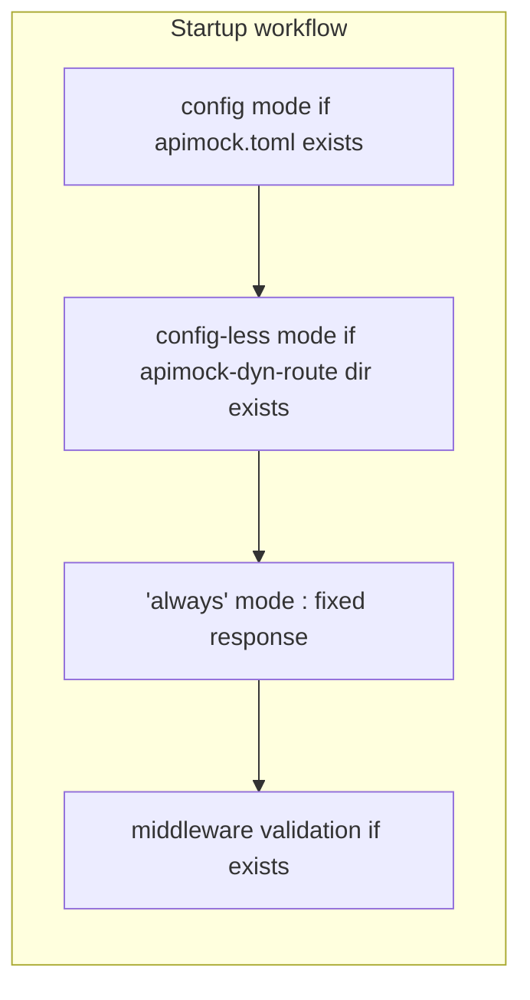
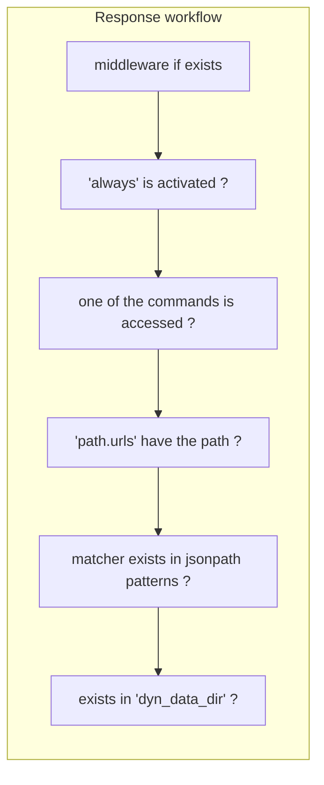

# Specifications

## Request and Response

### Request Matching

Matching is performed based on:

- URL path (e.g. `/api/v1/function`)
- Headers
- Request body content (JSON only)

### Response Sources

Responses are typically defined using:

- `.json` / `.json5` files for static responses.
- `.csv` files are available as JSON responses including records.
- Optionally, rule sets `.toml` offers way to define both text response and HTTP status code response.

## ~~How startup works~~

Below is v3 (todo)

### ~~How response works~~

Below is v3 (todo)

