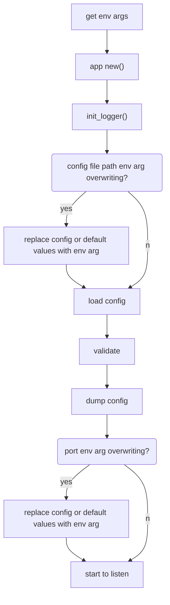
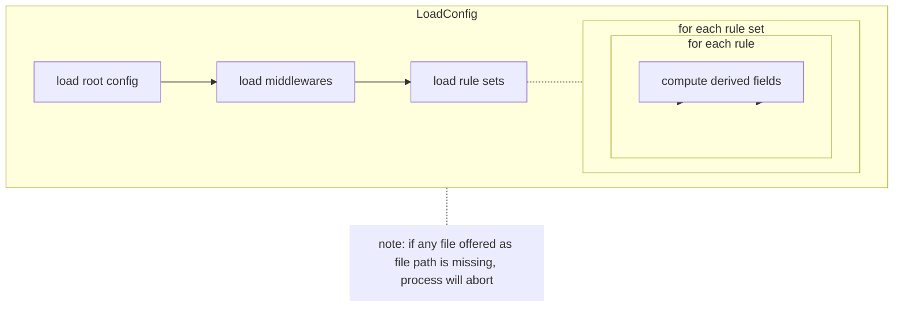
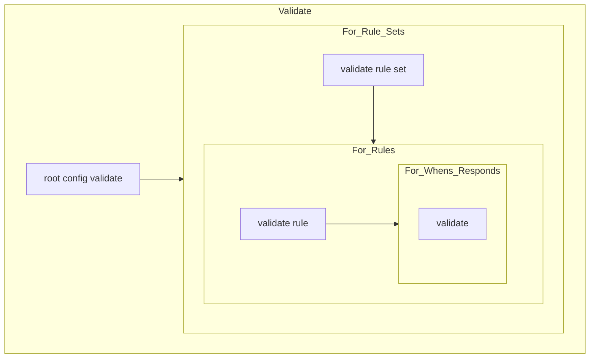
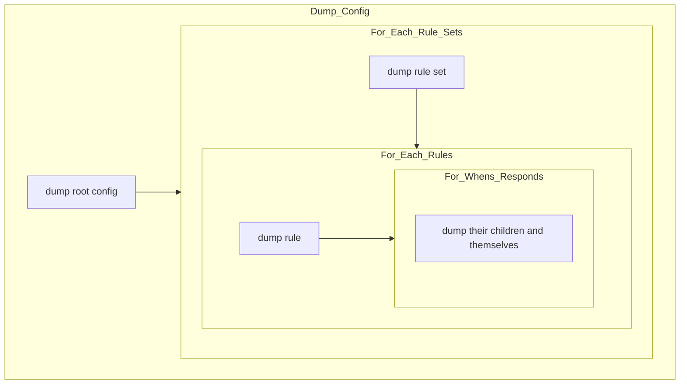

# Server launch

## Workflow

```mermaid
flowchart TD
    A[get env args]
    B["app new()"]
    C["init_logger()"]
    
    D(config file path env arg overwriting?)
    E[replace config or default values with env arg]
    
    F[load config]
    G[validate]
    H[dump config]
    
    I(port env arg overwriting?)
    J[replace config or default values with env arg]
    
    K[start to listen]

    A --> B --> C --> D
    D --yes--> E --> F
    D --no--> F
    F --> G --> H --> I
    I --yes--> J --> K
    I --no--> K
```

### load config

```mermaid
flowchart TD
    subgraph LoadConfig
        LC0[load root config]
        LC1[load middlewares]
        LC2[load rule sets]
    
        subgraph LC3[for each rule set]
            subgraph LC4[for each rule]
                LC5[compute derived fields]
            end
        end
    end

    Note1["note: if any file offered as file path is missing, process will abort"]
    style Note1 stroke:none

    LC0 --> LC1 --> LC2 -.- LC3
    LC3 --> LC4
    LC4 --> LC5
    LoadConfig -.- Note1
```

### validate

```mermaid
flowchart TD
    subgraph Validate
        A1[root config validate]
        subgraph For_Rule_Sets
            A2[validate rule set]
            subgraph For_Rules
                A3[validate rule]
                subgraph For_Whens_Responds
                    A4[validate]
                end
            end
        end
    end

    A1 --> For_Rule_Sets
    A2 --> For_Rules
    A3 --> For_Whens_Responds
```

### dump config

```mermaid
flowchart TD
    subgraph Dump_Config
        A1[dump root config]
        subgraph For_Each_Rule_Sets
            A2[dump rule set]
            subgraph For_Each_Rules
                A3[dump rule]
                subgraph For_Whens_Responds
                    A4[dump their children and themselves]
                end
            end
        end
    end

    A1 --> For_Each_Rule_Sets
    A2 --> For_Each_Rules
    A3 --> For_Whens_Responds
```
