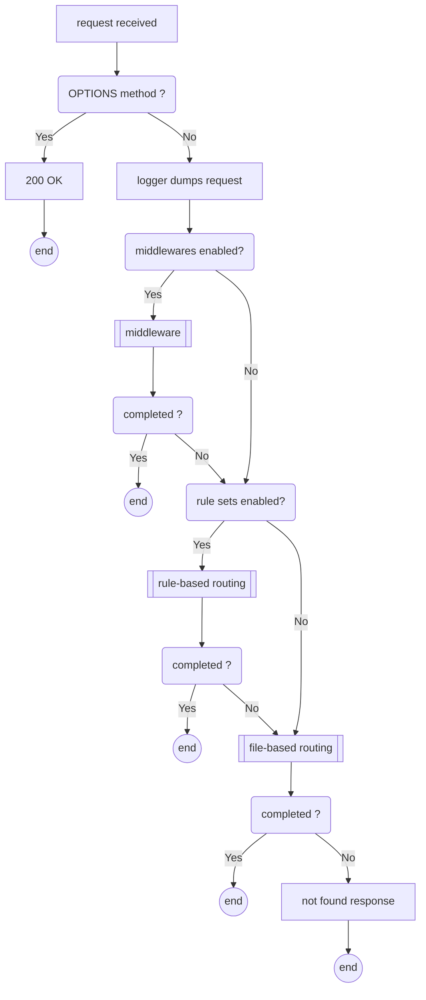
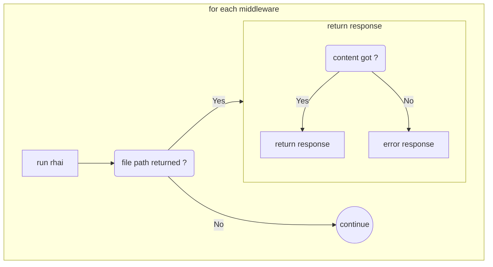
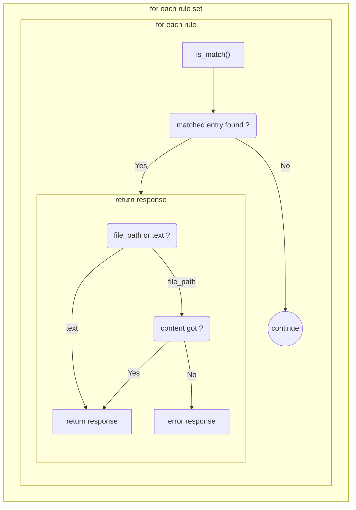
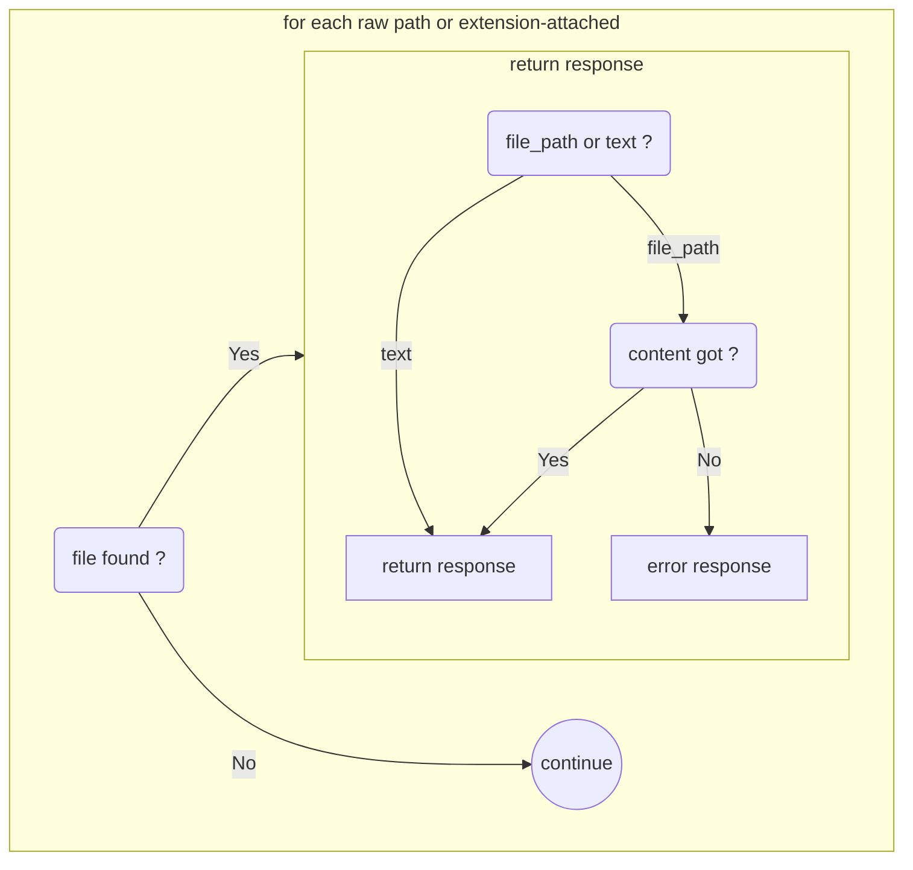

# Server response

## Flow

## Middleware

## Rule-based routing

## File-based routing

- try to use request url_path as file path from fallback_respond_dir
- try to find file as it is and then ones which are attached supported extensions to 

